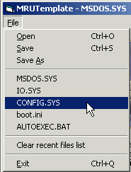



## Bobo Templates

### Description

The use of Templates can dramatically reduce development time and time spent debugging. The repeated use of the same code means that over time, that code gets tested in many environments, and gets further refinement to produce robust code and bug free applications. This submission contains two small simple "Templates" that you are free to use. Using "ModCmnDlg.bas" means that you do not have to use MS Common Dialog Control (comdlg32.ocx) for the simple task of opening and saving files. Using "ModMRU.bas" enables the easy addition of recently used files to menus in a form. This can make your application easier for the user to use and gives a more professional feel to the application

To those coders that have requested my Templates in the past - I am in the process of moving over to .NET and will release the more advanced ones over time, stay tuned !
 
### More Info
 

             |
---                |---
**Submitted On**   |2003-09-06 09:39:02
**By**             |[MrBobo](https://github.com/Planet-Source-Code/PSCIndex/blob/master/ByAuthor/mrbobo.md)
**Level**          |Beginner
**User Rating**    |5.0 (15 globes from 3 users)
**Compatibility**  |VB 6\.0
**Category**       |[Miscellaneous](https://github.com/Planet-Source-Code/PSCIndex/blob/master/ByCategory/miscellaneous__1-1.md)
**World**          |[Visual Basic](https://github.com/Planet-Source-Code/PSCIndex/blob/master/ByWorld/visual-basic.md)
**Archive File**   |[Bobo\_Templ164199962003\.zip](https://github.com/Planet-Source-Code/mrbobo-bobo-templates__1-48305/archive/master.zip)

